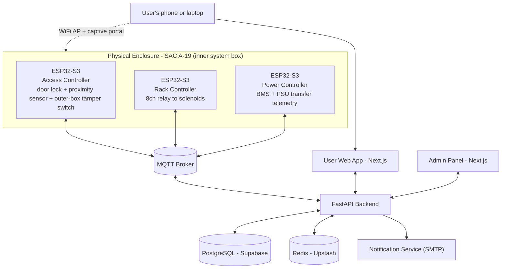
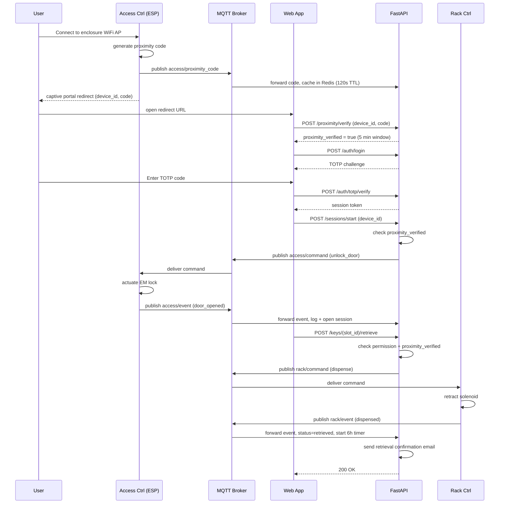

# Smart Key Storage System — Architecture

**Companion docs:** `PRD.md` (product requirements), `TRD.md` (technical/API spec)

## 1. Overview

The Smart Key Storage System (SNTC) web application is the software layer on top of the IoT hardware enclosure at the IIT Mandi Student Activity Center (A-19). It replaces coordinator-mediated key handoff with authenticated self-service retrieval, plus an admin panel for access control and auditing.

This document covers **software and integration architecture** — backend services, frontend apps, database, and the link between the web app and the physical enclosure.

## 2. System Components

| Layer | Component | Technology |
|---|---|---|
| Physical | Outer box (physical lock) + inner box (8-slot key rack) | See §4.1 |
| Embedded | 3× ESP32-S3 controllers | C++ / Arduino or ESP-IDF |
| Connectivity | Local WiFi AP (onboarding) + station uplink + MQTT | — |
| Backend | API server | FastAPI (Python) |
| Backend | Primary datastore | PostgreSQL (Supabase) |
| Backend | Cache / pub-sub / rate limiting / proximity codes | Redis (Upstash) |
| Backend | Device message broker | MQTT (managed, e.g. HiveMQ Cloud, or self-hosted Mosquitto) |
| Frontend | User web app | Next.js 14 |
| Frontend | Admin panel | Next.js 14, role-gated routes in the same app |
| Notification | Email via internal provider-pattern module | SMTP (configurable to other providers) |

## 3. High-Level Architecture

## 4. Component Details

### 4.1 Physical Enclosure — two-box design

The system is housed in two nested enclosures:

- **Inner box** — the smart system: 8-slot key rack, solenoids, EM door lock, all 3 ESP32-S3 controllers. Normal daily access happens entirely here, digitally.
- **Outer box** — a secondary physical shell with its own separate mechanical lock. It stays closed and is never touched during normal use. If there's a mishap (power failure, controller fault, total lockout), authorized staff open the outer box with a physical key and take keys directly, bypassing the inner smart system entirely.

**Recommendation:** fit the outer box door with a magnetic reed/tamper switch, wired to the Access Controller. This means even a legitimate physical-key entry still produces a logged, immediately-alerted event — the emergency path stays audited even though it needs no digital authorization to use. Without this, the outer box is a completely invisible bypass, which is a real risk for a system whose whole point is an audit trail.

### 4.2 Embedded Controllers — proposed role split

The hardware BOM specifies 3× ESP32-S3 without assigning roles. Proposed split, so a compromised or misbehaving controller has the smallest possible blast radius:

| Controller | Responsibility | Talks to |
|---|---|---|
| Access Controller | Actuate 12V EM door lock (inner), read proximity sensor, read outer-box tamper switch, serve captive-portal redirect + proximity code | MQTT broker |
| Rack Controller | Drive 8-channel relay → 8 push-pull solenoids, report per-slot key-present state | MQTT broker |
| Power Controller | Monitor BMS/battery %, control PSU transfer relay, report power telemetry | MQTT broker |

Each controller authenticates to the broker with its own credentials — the Rack Controller should never be able to command the door lock, and vice versa.

### 4.3 Connectivity & Communication

**Local onboarding:** enclosure broadcasts a WiFi AP. User's device connects, gets DNS-redirected to a captive portal page served by the Access Controller.

**Uplink:** controllers also join institute WiFi (station mode) or a wired uplink for internet access to the MQTT broker and, through it, the backend.

**Proximity verification:** login and status browsing work from any network — needed for coordinators/admins checking status remotely, and for members checking "is my key available" before walking over. But starting a session, retrieving, and returning a key all require proof of being on-site *right now*. On AP connect, the Access Controller generates a short random code and publishes it over MQTT; the backend caches it in Redis for 2 minutes; the captive portal redirect carries the code to the web app, which exchanges it for a short-lived "proximity-verified" flag on the session. Full protocol in `TRD.md` §7.

This deliberately does **not** require hosting the dashboard on the ESP — see `TRD.md` §7 for the reasoning.

MQTT topic structure:

| Topic | Direction | Payload |
|---|---|---|
| `device/{id}/access/command` | Backend → Access Ctrl | `{action:"unlock_door", session_id, ttl_s}` |
| `device/{id}/access/event` | Access Ctrl → Backend | `{event:"door_opened" or "door_closed", ts}` |
| `device/{id}/access/proximity_code` | Access Ctrl → Backend | `{code, ts}` — new AP client connected |
| `device/{id}/access/tamper_event` | Access Ctrl → Backend | `{ts}` — outer-box switch tripped |
| `device/{id}/rack/command` | Backend → Rack Ctrl | `{action:"dispense" or "lock", slot_id, nonce}` |
| `device/{id}/rack/event` | Rack Ctrl → Backend | `{slot_id, event:"dispensed" or "returned", ts}` |
| `device/{id}/power/telemetry` | Power Ctrl → Backend | `{battery_pct, on_backup, rssi, ts}` every 60s |
| `device/{id}/+/heartbeat` | any → Backend | `{firmware_version, uptime_s, ts}` every 30s |

### 4.4 Backend Services (FastAPI)

- **Auth service** — credential login, TOTP enroll/verify, session issuance
- **Proximity service** — validates device-issued codes, sets/checks the proximity-verified flag
- **Key service** — retrieve/return/extend, permission checks, MQTT command dispatch
- **Admin service** — user/room/permission CRUD (scoped by role), logs, device health
- **MQTT listener (background worker)** — subscribes to device event/telemetry topics, writes to DB, pushes live updates to the frontend via Redis pub/sub → WebSocket
- **Notification service** — retrieval confirmation, reminders, overdue warnings, coordinator escalation, all via the existing internal SMTP-based email module

Redis: session cache, login rate-limiting, proximity codes, live "who holds what" board without polling the DB. Postgres (Supabase): source of truth for users, permissions, key/slot state, all logs.

### 4.5 Frontend

**User web app** — login and the key-status grid are reachable from anywhere. Retrieve / return / start-session actions are disabled (with a clear "connect to enclosure WiFi" prompt) until the proximity flag is set.

**Admin panel** — role-gated section covering user & permission management (scoped per role — see `TRD.md` §8), live monitoring, device health, and audit logs. Fully reachable remotely, since coordinators/admins need to monitor without being at the enclosure.

## 5. Data Flow — Key Sequences

### 5.1 Enclosure Unlock + Key Retrieval

### 5.2 Key Return

Same login flow, plus a **fresh** proximity verification — a return shouldn't be allowed to ride on a proximity check from hours earlier. `POST /keys/{slot_id}/return` publishes `rack/command {action:"unlock"}` for reinsertion; a `returned` event flips status to `available` and closes the `retrieval_logs` row.

### 5.3 Overdue Handling

| Event | Timing | Recipient |
|---|---|---|
| Retrieval confirmation | Immediate | Member |
| Return reminder | T-30min before due | Member |
| Overdue warning (failure 1) | At due time | Member |
| Coordinator escalation (failure 2) | T+2h past due | Coordinator, via `rooms.coordinator_id` |

All timings are admin-configurable defaults. Full email integration in `TRD.md` §12.

### 5.4 Outer Box Emergency Access

1. Staff opens the outer box with the physical key
2. Reed/tamper switch trips → Access Controller publishes `access/tamper_event`
3. Backend writes an `override_logs` row and immediately notifies the admin (not just logged for later review)
4. Admin adds a resolution note to clear the flag

## 6. Database Schema — Overview

`users`, `rooms` (now carries `coordinator_id`), `devices`, `key_slots`, `permissions`, `sessions`, `retrieval_logs` (now carries `reminder_count`), `access_logs`, `override_logs`, `notifications`. Full DDL in `TRD.md` §5.

## 7. Security Architecture

- Two-factor login (password + TOTP, RFC 6238) required before any door command is issued
- Retrieve/return/start-session additionally require a fresh proximity-verified flag (§4.3)
- Session tokens short-lived, server-side revocable (Redis-backed)
- Per-controller MQTT credentials — no shared broker password across the 3 devices
- TLS on all HTTP + MQTT traffic
- Every unlock/dispense command carries a single-use nonce tied to the initiating session — replay protection
- Outer-box emergency access bypasses digital auth by design (it's the physical fallback) — the tamper switch (§4.1) is what keeps it audited rather than silent
- Admin panel gated by RBAC, scoped by room for coordinators (`TRD.md` §8)
- Login/TOTP attempts rate-limited via Redis

## 8. Deployment Architecture

| Component | Suggested host | Why |
|---|---|---|
| FastAPI backend | Railway / Fly.io | simple deploy, cheap at student-project scale |
| PostgreSQL | Supabase | generous free tier |
| Redis | Upstash | free tier, serverless-friendly |
| Next.js (user + admin) | Vercel | free tier, zero-config |
| MQTT broker | HiveMQ Cloud free tier, or self-host Mosquitto alongside FastAPI | less to operate for a single-enclosure prototype |
| Email module | Runs as an internal library inside the FastAPI service | no separate hosting needed |

## 9. Scalability

Single enclosure today, but the schema is already multi-device (`devices`, `key_slots.device_id`) — a second enclosure is a data-only addition, not a redesign. FastAPI is stateless per-request, so horizontal scaling is just adding instances behind a load balancer if usage grows.

## 10. Failure Modes & Resilience

- **Uplink down:** controllers can't reach the MQTT broker → no digital retrieval possible. The outer box is the documented physical fallback for this — see §4.1 and §5.4.
- **Power outage:** battery backup keeps controllers alive; Power Controller should report `on_backup:true` so the admin dashboard reflects degraded state.
- **Broker unreachable from device:** buffer events locally on the ESP32 and flush on reconnect, so `access_logs` stays complete.

## 11. Open Design Risks

1. **The tamper switch is load-bearing for the whole audit story.** If it's skipped as "just a BOM add," outer-box access becomes a silent, fully unaudited bypass again. Treat it as a must-build, not optional.
2. **TOTP device loss has no defined recovery flow.** Needs an admin-mediated re-enrollment path or it becomes a support bottleneck every time someone gets a new phone.
3. **Concurrent retrieval race.** Two near-simultaneous requests on the same slot need a DB-level atomic check, not app-level check-then-set. Addressed in `TRD.md` §5.
